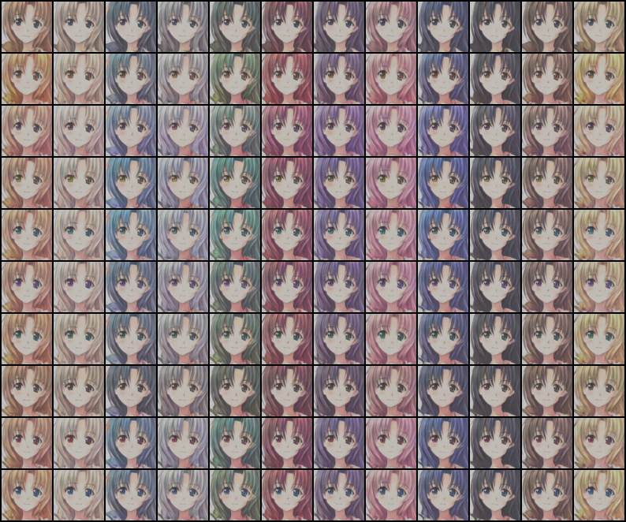
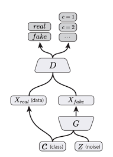
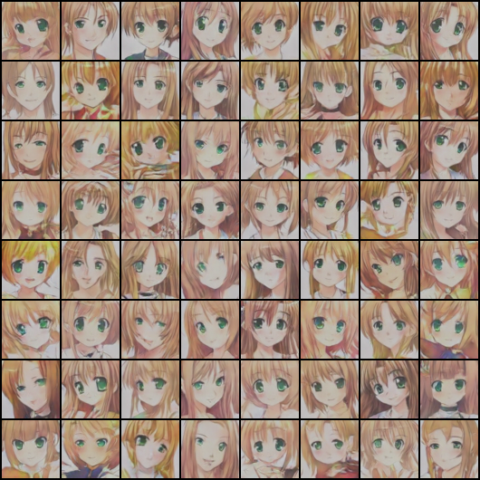
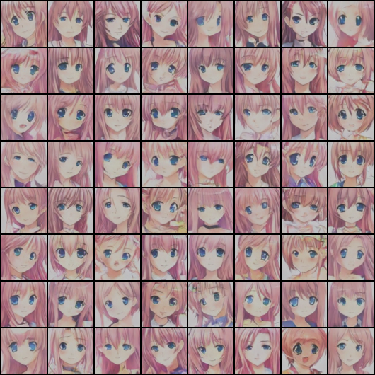
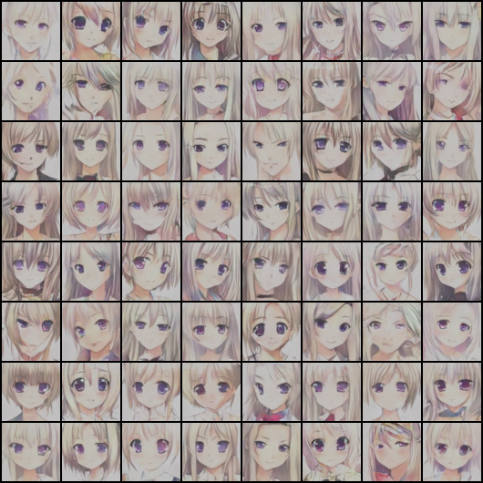

# Anime-Generation
A very simple DCGAN-based baseline model for anime generation using ACGAN. The pretrained generator model can be found here: https://drive.google.com/file/d/1OFdtSHhmNiMXCBxCzjOQyc4w49sHS9jZ/view?usp=sharing. 


## Usage
### Training 
```
>>> python3 train.py -h
usage: train.py [-h] [-d {cuda,cpu}] [-i ITERATIONS] [-b BATCH_SIZE]
                [-t TRAIN_DIR] [-s SAMPLE_DIR] [-c CHECKPOINT_DIR]
                [--sample SAMPLE] [--check CHECK] [--lr LR] [--beta BETA]
                [--aux AUX]

optional arguments:
  -h, --help            show this help message and exit
  -d {cuda,cpu}, --device {cuda,cpu}
                        Device to train the model on
  -i ITERATIONS, --iterations ITERATIONS
                        Number of iterations to train ACGAN
  -b BATCH_SIZE, --batch_size BATCH_SIZE
                        Training batch size
  -t TRAIN_DIR, --train_dir TRAIN_DIR
                        Training data directory
  -s SAMPLE_DIR, --sample_dir SAMPLE_DIR
                        Directory to store generated images
  -c CHECKPOINT_DIR, --checkpoint_dir CHECKPOINT_DIR
                        Directory to save model checkpoints
  --sample SAMPLE       Sample every _ steps
  --check CHECK         Save model every _ steps
  --lr LR               Learning rate of ACGAN. Default: 0.0002
  --beta BETA           Momentum term in Adam optimizer. Default: 0.5
  --aux AUX, --classification_weight AUX
                        Classification loss weight. Default: 1
```

The directory tree is organized as follows:
```
├── Anime Generation
    ├── src
    │    ├── train.py
    │    ├── datasets.py
    │    ├── ACGAN.py
    │    ├── utils.py
    │
    ├── {training data}
    │    ├── images  # Training images
    │    ├── tags.pickle  # One-hot encoding tags for training images
    │    ├── hair_prob.npy  # Probability distribution for hair classes.
    │    ├── eye_prob.npy  # Probability distribution for eye classes.
    │
    ├── {generated samples}
    │    ├──{train event}
    │        ├── real.png
    │        ├── fake_step_100.png
    │        ├── ...
    │        
    ├──checkpoints
        ├──{train event}
            ├── loss.png
            ├── classifier_loss.png
            ├── G_10000.ckpt
            ├── D_10000.ckpt
            ├── ....
```

Please pass your own training data folder, generated samples folder, and checkpoint folder as arguments when running `train.py`. Default folders are `data`, `samples`, and `checkpoints`.  
  
Images are tagged with the following labels:  
- Hair tags (12 classes)
```python
['orange', 'white', 'aqua', 'gray', 'green', 'red', 'purple', 'pink', 'blue', 'black', 'brown', 'blonde']
```
- Eye tags (10 classes)
```python
['black', 'orange', 'pink', 'yellow', 'aqua', 'purple', 'green', 'brown', 'red', 'blue']
```
Each training image is tagged with exactly two labels: one from hair tags and the other from eye tags. In `tags.pickle`, each image index is associated with a 22-dimensional tensor (which is a multi-label one-hot encoding). 

```python
{1: tensor([1.0, 0, 0, 0, ......., 1.0, 0, 0]),
 2: tensor([0, 0, 1.0, 0, ......., , 0, 0, 1.0],
 ......}
```
You can find the training data here: https://drive.google.com/file/d/1jdJXkQIWVGOeb0XJIXE3YuZQeiEPd8rM/view?usp=sharing.
***
### Testing
```
>>> python3 test.py -h

usage: test.py [-h] [-t {fix_noise,fix_hair_eye,change_hair,change_eye}]
               [--hair {orange,white,aqua,gray,green,red,purple,pink,blue,black,brown,blonde}]
               [--eye {black,orange,pink,yellow,aqua,purple,green,brown,red,blue}]
               [-s SAMPLE_DIR] [-d MODEL_DIR]

optional arguments:
  -h, --help            show this help message and exit
  -t {fix_noise,fix_hair_eye,change_hair,change_eye}, --type {fix_noise,fix_hair_eye,change_hair,change_eye}
                        Type of anime generation.
  --hair {orange,white,aqua,gray,green,red,purple,pink,blue,black,brown,blonde}
                        Determine the hair color of the anime characters.
  --eye {black,orange,pink,yellow,aqua,purple,green,brown,red,blue}
                        Determine the eye color of the anime characters.
  -s SAMPLE_DIR, --sample_dir SAMPLE_DIR
                        Folder to save the generated samples.
  -d MODEL_DIR, --model_dir MODEL_DIR
                        Folder where the trained model is saved
```
## Model Architecture
### DCGAN 


For more details on DCGAN, please refer to https://github.com/Mckinsey666/GAN-Tutorial and the original paper: https://arxiv.org/abs/1511.06434.
### ACGAN 

  
In ACGAN, the discriminator not only learns to discriminate between real and synthesized images, but also needs to classify images into different classes. This not only stablizes training, but also allows us to manipulate generated image attribures.  

For more information, please refer to the original ACGAN paper: https://arxiv.org/abs/1610.09585.
## Algorithm

Some modifications are made:
1. The classification loss for the synthesized image was omitted, since we believe the fake image would confuse the discriminator.
2. The adversarial loss for the discriminator was divided by 2 (average of the fake adversarial loss and real adversarial loss)
## More Results
Fixed noise, change eye and hair colors.


***
Fixed eye attribute and noise, change hair colors.


***
Fixed hair attribute and noise, change eye colors.


***
Fixed hair and eye attributes, change noise.

- Orange hair green eyes



- Pink hair blue eyes



- White hair purple eyes



## Improvements to be made
- Low color intensity
    - Try removing batch norm in discriminator
    - Might be a type of mode collapse


